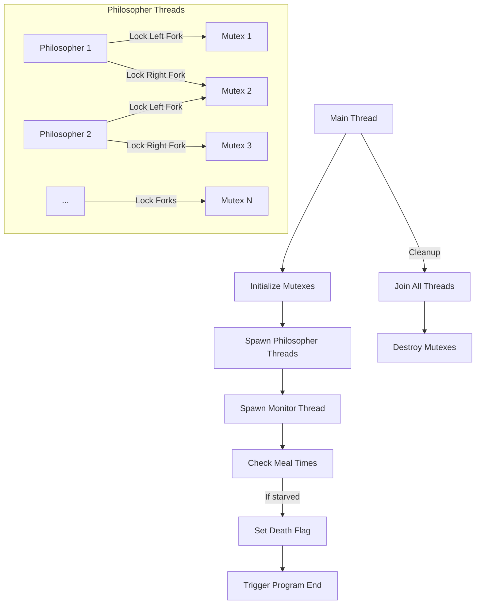

# 🍽️ 42 Philosophers - Multithreaded Dining Simulation

A multithreading solution to the classic Dining Philosophers problem, demonstrating synchronization with mutexes and threads.

## 🌟 Features

| **Category**       | **Details**                                                                 |
|--------------------|-----------------------------------------------------------------------------|
| **Threading**      | Full multithreaded implementation with `pthread`                            |
| **Synchronization**| Mutex-protected shared resources (forks, status, print)                    |
| **Time Management**| Precise microsecond sleeping with `usleep`                                  |
| **Error Handling** | Comprehensive mutex/thread cleanup on exit                                  |
| **Monitoring**     | Dedicated monitor thread for philosopher health checks                      |

---
# **Introduction to Threads and Mutexes in the Dining Philosophers Problem**

## **1. Threads: Parallel Execution**
Threads are lightweight processes that allow a program to perform multiple operations **concurrently** within the same memory space. Unlike processes, threads share the same heap memory, file descriptors, and global variables, making communication between them faster but requiring careful synchronization.

### **Key Properties of Threads:**
- **Shared Memory**: All threads in a process can access the same variables.
- **Independent Execution Flow**: Each thread runs its own code segment.
- **Faster Context Switching**: Threads are cheaper to create and switch than processes.
- **Potential Race Conditions**: Since threads share data, uncontrolled access can lead to inconsistencies.

### **Threads in the Dining Philosophers Problem:**
- Each philosopher is represented by a thread (`pthread_t`).
- All philosopher threads run simultaneously, trying to eat, sleep, and think.
- Threads must **synchronize** when accessing shared resources (forks).

---

## **2. Mutexes: Preventing Chaos**
A **mutex (mutual exclusion lock)** ensures that only one thread can access a shared resource at a time. It prevents **race conditions** where multiple threads modify data unpredictably.

### **How Mutexes Work:**
1. **Lock**: A thread acquires a mutex before accessing a shared resource.
   - If locked, other threads **wait** until it’s released.
2. **Critical Section**: The thread performs operations safely.
3. **Unlock**: The thread releases the mutex, allowing others to proceed.

### **Mutexes in the Dining Philosophers Problem:**
- Each fork is represented by a mutex (`pthread_mutex_t`).
- A philosopher must **lock both adjacent forks** (left and right) to eat.
- If a fork is already taken (locked), the philosopher **waits**.
- Deadlock risk: If all philosophers grab one fork simultaneously, they **freeze** waiting for the second fork.

---

## **3. The Dining Philosophers Challenge**
The problem demonstrates **synchronization issues** in concurrent systems:
- **Deadlock**: All philosophers hold one fork and wait indefinitely.
- **Starvation**: Some philosophers may never get both forks.
- **Race Conditions**: Forks could be accessed by multiple threads at once.

### **Solution Approach in This Project:**
1. **Mutex-Protected Forks**:
   - Each fork is a mutex (`pthread_mutex_t fork`).
   - Philosophers must lock both left & right forks to eat.
2. **Time Constraints**:
   - `ttdie`: Maximum time a philosopher can go without eating.
   - `tteat` / `ttsleep`: Fixed durations for eating and sleeping.
3. **Monitor Thread**:
   - Continuously checks if any philosopher has **starved** (`lastmeal > ttdie`).
   - If so, terminates the simulation.


---


## **4. Visualizing Thread & Mutex Interaction**

### **Key Takeaways:**
- Threads enable **concurrent execution** but require synchronization.
- Mutexes **prevent race conditions** by enforcing exclusive access.
- The Dining Philosophers problem illustrates **real-world concurrency challenges** (deadlock, starvation).
- This project implements a **deadlock-free solution** using mutexes and monitoring.

## 🖥️ System Architecture

### Thread Interaction Flowchart



### Key Interactions Explained:
1. **Main Thread**  
   - Initializes all mutexes (`fork`, `print`, etc.)
   - Spawns N philosopher threads + 1 monitor thread

2. **Philosopher Threads**  
   - Try to lock **left fork** (current index mutex)
   - Try to lock **right fork** (next index mutex)
   - If both acquired:  
     ```
     EAT → update last_meal → SLEEP → THINK
     ```

3. **Monitor Thread**  
   - Continuously checks `last_meal` times
   - If `(current_time - last_meal) > time_to_die`:  
     - Locks `print` mutex
     - Announces death
     - Sets `dead` flag to terminate program

4. **Termination**  
   - Main thread joins all threads
   - Destroys mutexes in reverse initialization order


## 🏗️ Project Structure

```c
/* Philosopher individual data */
typedef struct s_philo {
    bool            forks;      // Flag indicating if forks are available
    int             n;          // Philosopher's unique ID (1 to n_philo)
    long            lastmeal;   // Timestamp (ms) of last meal start
    int             meals;      // Meals consumed count (for optional meal limit)
    pthread_t       thread;     // Thread handle for this philosopher
    pthread_mutex_t fork;       // Mutex representing a fork (shared with neighbor)
} t_philo;

/* Shared simulation control data */
typedef struct s_vars {
    /* Simulation parameters */
    int             n_philo;    // Total number of philosophers
    long            tteat;      // Time (ms) required to eat
    long            ttdie;      // Time (ms) before starving
    long            ttsleep;    // Time (ms) spent sleeping
    long            status;     // Program state flag (running/ended)
    
    /* Meal tracking */
    int             nmeals;     // Optional meal limit (-1 if infinite)
    int             mealcount;  // Global meals eaten counter
    
    /* Utility fields */
    int             i;          // Loop counter
    long            stime;      // Simulation start timestamp (ms)
    bool            dead;       // Death flag (true if any philosopher died)
    
    /* Mutexes */
    pthread_mutex_t var;        // Protects shared variables
    pthread_mutex_t print;      // Synchronizes output printing
    pthread_mutex_t inc;        // Protects meal counters
    pthread_mutex_t time;       // Protects time-sensitive operations
    pthread_mutex_t m_philo;    // Protects philosopher array access
    
    /* Threads */
    pthread_t       monitor;    // Health check thread
    t_philo         **philo;    // Array of philosopher pointers
} t_vars;
```

## 🚀 Quick Start

### Prerequisites
- GCC compiler
- Make
- pthread library

### Compilation
```bash
make
```

### Usage
```bash
./philo <number_of_philos> <time_to_die> <time_to_eat> <time_to_sleep> \
[number_of_meals]
```

**Example:**
```bash
./philo 5 800 200 200 7  # 5 philos, die after 800ms, eat for 200ms, etc.
```

## 🧠 The Dining Problem

Simulates philosophers who:
1. Alternate between thinking and eating
2. Must share forks (resources) with neighbors
3. Can starve if they don't eat in time
4. May enter deadlock if improperly synchronized

## 🔧 Key Functions

| **Function**         | **Purpose**                                  |
|----------------------|---------------------------------------------|
| `init_philo()`       | Initialize philosopher threads               |
| `init_mutexs()`      | Create mutexes for shared resources         |
| `*monitor()`         | Health-check thread                         |
| `eating_msg()`       | Thread-safe status printing                 |
| `ft_usleep()`        | Precision microsecond sleeping              |
| `get_time()`         | Timestamp in milliseconds                   |

## 🎨 Sample Output

```
[timestamp_ms] Philosopher 1 has taken a fork
[timestamp_ms] Philosopher 2 is eating
[timestamp_ms] Philosopher 3 is sleeping
[timestamp_ms] Philosopher 4 died 💀
```

## 🛠️ Error Handling

The program gracefully handles:
- Invalid input values
- Mutex initialization failures
- Thread creation errors
- Resource leaks (full cleanup on exit)

## 📚 Resources

1. [Dining Philosophers Problem (Wikipedia)](https://en.wikipedia.org/wiki/Dining_philosophers_problem)
2. [pthread Manual](https://man7.org/linux/man-pages/man7/pthreads.7.html)
3. [Mutex Locking Patterns](https://riptutorial.com/c/example/31615/introduction-to-mutexes)

---
